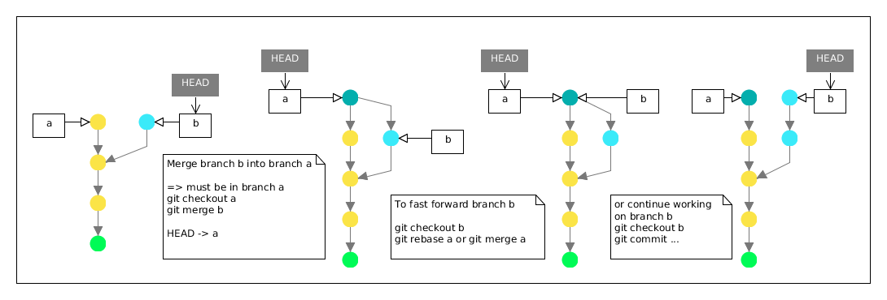
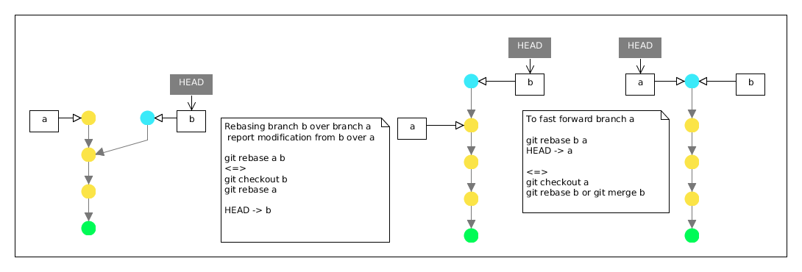
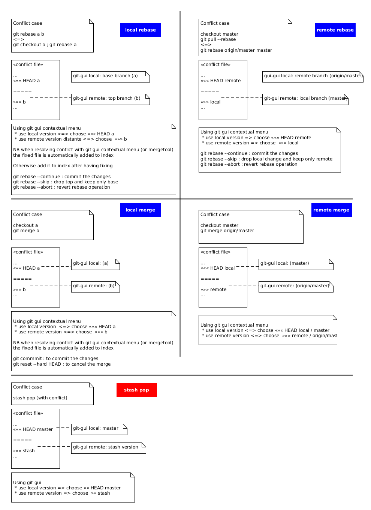
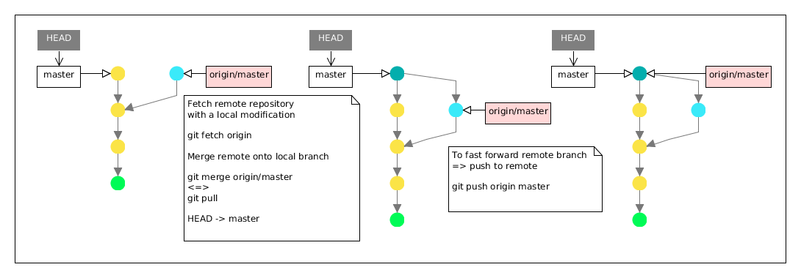
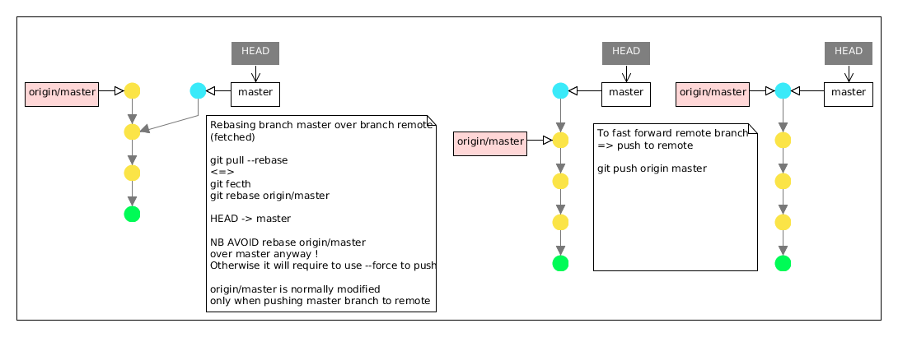

# git ref

Table of Contents
=================

   * [Config](#config)
     * [Levels of config](#levels-of-config)
     * [Identity](#identity)
     * [Credentials](#credentials)
     * [Editor](#editor)
     * [Pager](#pager)
     * [Merge tool](#merge-tool)
   * [Basics](#basics)
     * [Setup](#setup)
     * [Working directory and Staging](#working-directory-and-staging)
     * [Status](#show-status)
     * [Commiting](#commiting)
     * [Branching](#branching)
     * [Merging & Rebasing](#merging-&-rebasing)
     * [Squashing](#squashing)
     * [Cherry picking](#cherry-picking)
     * [Merge conflicts](#merge-conflicts)
   * [Infos](#infos)
     * [References](#references)
     * [Logs](#logs)
     * [Show file content](#show-file-content)
     * [Diff](#diff)   
   * [Remotes](#remotes)
     * [Pulling data](#pulling-data)
     * [Pushing data](#pushing-data)
   * [Tags](#tags)
     * [Pushing tags](#pushing-tags)
     * [Deleting tags](#deleting-tags)
   * [Utils](#utils)
     * [Stashing](#stashing)
     * [Alias](#alias)
     * [Submodule](#submodule)
   * [Plumbing commands](#plumbing-commands)


Visualizing Git Concepts with D3 : http://onlywei.github.io/explain-git-with-d3/

## Config

### Levels of config

> 3 different levels of configuration

* _/etc/gitconfig_ : values for every user on the system
 ```git config --list --system```
* _~/.gitconfig_ : Specific to your user
  ```git config --list --global```
* _.git/config_ config file in the git directory : Specific to that single repository
 ```git config --list```

### Set config

> To set a new key/value in git config
```sh
git config [--global | --system ] key value
# alternative
git config [--global | --system] -e # edit file [keysection] keyname=value
```

> To unset values
```sh
git config [--global | --system] --unset key
# alternative
git config [--global | --system] -e # edit file [keysection] remove keyname
```

### Identity

> Setting identity (minimal required to add new commit)

```sh
git config --global user.name "John Doe"
git config --global user.email johndoe@example.com
```


### Credentials

#### Credential helper


> Turn on the credential helper so that Git will save your password in memory for some time.

```sh
# Set git to use the credential memory cache
# By default, Git will cache your password for 15 minutes.
git config --global credential.helper cache

# Set the cache to timeout after 1 hour
git config --global credential.helper 'cache --timeout=3600'

# or defined permanently
git config credential.helper store

```
### Editor

```sh
git config --global core.editor vim
```

### Pager 

#### Turn off pager (used by log, diff, list)

> Turn off permanently

```sh
git config --global core.pager ''

# or only for the current git repo
git config core.pager ''

```

> or temporary using `--no-pager` option for git (=> before subcommand)

```sh
git --no-pager log --oneline
```

restore initial (system) setting

```sh
git config --global --unset core.pager
```

#### Use most as pager

> by default pager is `less`

```sh
git config --global core.pager most
```

### Merge tool

#### Using graphical external tool

*temporary* : to launch graphical diff tool (e.g meld, kdiff3) instead of the default diff 

```sh
# -y no prompt option
git difftool -y -t meld
```

*permanently* : configure merge tool

```sh
git config --global merge.tool meld
```

then use mergetool to resolve conflicts

```sh
git mergetool -y
```

#### Remove the backup .orig

To automatically remove the backup .orig as files are successfully merged by git mergetool set `mergetool.keepBackup` to false

```sh
git config --global mergetool.keepBackup false
```

### Dealing with end of line

```sh
# for windows using cross compile env => checkout convert LF to CRLF, always commit LF 
git config --system core.autocrlf true


# for linux or windows wanting LF end of line, checkout and commit LF
git config --system core.autocrlf input
```

## Basics

### Setup

```sh
# create a new empty repository
git init

# or clone the repository specified by <repo>
git clone <repo_url>

# clone and checkout in a specific branch
git clone <repo_url> --branch <branch>

# create a new empty repository without checkout (server side)
git init --bare test.init

# clone remote repository as a bare repo
git clone --bare url repository.git

```

### Working directory and Staging

```sh
# to add all modified files in index 
git add .  # <=> git stage

# to add only modified files already in source control 
git add -u 

# to unstage file <=> reset [--mixed]
git reset file

# to unstage all modified files added to index
git reset  # <=> git reset HEAD

# to remove file from index
git rm --cached file

# to remove file from index & workspace
git rm file

# move or rename file
git mv file newfile

# revert change in index & workspace
git checkout HEAD file # <=> git reset file && git checkout file
# <=> git extras : git reset-file file

# revert change in workspace using index
git checkout file

# revert all changes
git checkout HEAD -- .  # <=> git checkout .

# revert all changes including new files added in index => also removed from workspace !!! 
git reset --hard # <=> git reset --hard HEAD

# Remove the latest commit, keeping change in index
git reset --soft HEAD~ # git extras: git back

# Remove the latest commit
git reset HEAD~ # <=> git extras : git undo

# Remove the latest commit 
git reset --hard HEAD~ # <=> git extras : git undo --hard

# Remove untracked files from the working tree
git clean -n # dry run
git clean -i # Interactive mode
git clean -f # force mode

```

### Show status

```sh
# checking workspace status
git status

git status -s # short desc
git status -bs # show current branch with short desc
git status -v # show status and patch index
```

### Commiting

```sh
# commit changes staged in index
# -v  commit verbosely, i.e. includes the diff of the contents being committed in the commit message screen
# => open the configured editor to edit the commit message
git commit -v

# -m specify directly commit message
git commit -m 'commit msg'

# automatically stage every modified file that is already tracked before doing the commit 
git commit -a -m 'commit msg'
# <=> git add -u && git commit -m 'commit msg'

# bypass pre-commit hook : -n or --no-verify
git commit --no-verify -m 'commit msg'

# amend the last commit : change the commit message, or modify some files => git add files
git commit --amend # -m 'new commit message'
 # <=> to
git reset --soft HEAD~ && git add some_files && git commit -m "new msg"
# <=> git extras
git back && git add some_files && git commit -m "new msg"
```

### Branching

> a branch in Git is : a simple pointer or reference to the head of a line of work designated by sha1

```sh
cat  .git/refs/heads/master
```

```sh
# list all local branches
git branch
# <=> ls .git/refs/heads

# retrieve current branch name
git rev-parse --abbrev-ref HEAD # | sed "s#heads/##"  # Special case when tag and branch have the same name
git symbolic-ref --short HEAD # | sed "s#heads/##" 

# list all local branches in verbose mode
git branch -v

# list all remote branches
git branch -r

# list all local and remote branches
git branch -a

# list all local and remote branches with all details
git branch -av

# show branches merged in the current branches with their last commit log 
git branch -v --merged

# show branches not merged in current branch
git branch --no-merged


# create a new branch named <branch>, referencing the same point in history as the current branch or HEAD pointer
git branch <branch> # <=> git branch <branch> HEAD
# <=> git update-ref refs/heads/<branch> HEAD
# <=> git update-ref refs/heads/<branch> $(git rev-parse HEAD)
# <=> git rev-parse HEAD > .git/refs/heads/<branch>

# create a new branch named <branch>, referencing <start-point> (e.g. commit-id, tag or branch name)
git branch <branch> <start-point>
# <=> git update-ref refs/heads/<branch> <start-point>
# <=> git rev-parse <start-point> > .git/refs/heads/<branch>

# rename branch
git branch -m branch new_name
# git alias : git rename-branch new_name [old_branch] # work only if remote branch exist

# move branch label
git update-ref refs/heads/<branch> new_rev

# swith to branch
git checkout <branch>
# => udpate HEAD pointer i.e. .git/HEAD content
# <=>
git symbolic-ref HEAD refs/heads/newbranch  # NB also update the working copy
# <=>
sed -i s/heads$/heads\/newbranch/ .git/HEAD && git reset --hard

# create a new branch <new> referencing <start-point>, and check it out.
git checkout -b <new> <start-point>
# <=>
git branch <new> <start-point>
git checkout <new>

# git extras - create-branch : create a new branch (local & remote) ; checkout this one and setup a tracking remote branch
git create-branch demo -r 
# <=> git checkout -b demo ; git push --set-upstream origin demo
# <=> git push origin HEAD:refs/heads/demo ; git checkout demo

# remove branch (locally)
git branch -d <branch>
# <=>
rm .git/refs/head/<branch>

# remove branch even if not merged in remaining one
git branch -D <branch>

# git extras : git delete-branch <branch> # NB delete local and remote branch
git delete-branch demo # ok if remote also exist

```

### Merging

> NB to merge another branch in the current branch (=> checkout the branch in which the merge is wanted)

```sh
git merge <branch_name> [--no-commit] [--no-ff]

# --no-ff : flag causes the merge to always create a new commit object, even if the merge could be performed with a fast-forward.
# --no-commit to not autocommit the  result

# NB after merge, HEAD points to current branch

```



### Rebasing

> To rebase modifications from branch_b over branch_a ( or top_branch over bottom_branch)

```sh
git rebase <bottom_branch> <top_branch>

git rebase branch_a branch_b
# <=> 
git checkout branch_b
git rebase branch_a

# NB after rebase, HEAD points to branch_b
```



**Do not rebase commits that you have pushed to a public repository.**

If you treat rebasing as a way to clean up and work with commits **before** you push them, and if you only rebase commits that have never been available publicly, then you’ll be fine.


### Cherry picking

```sh
git cherry-pick commit-id

# cherry-pick multiple commits 
git cherry-pick -n commit-id
git cherry-pick -n commit-id2
git cherry-pick commit-id3

```

### Squashing

```sh
# Takes all the work on the merged branch and squashes it into one non-merge commit on top of the branch you’re on.
git merge <branch_name_from> --squash # => then git commit 

# Using git extras squash command
git squash <branch_name_from> <commit-msg> # checkout a branch from which rebasing on
git squash <commit-id> <commit-msg> # squash on the same branch

# alternative use from HEAD position on current branch or a new branch : git reset --soft commit-id
git reset --soft start-commit-id # then git commit

# for the dumb
git rebase -i <commit-id> # rewrite history 
git rebase --continue

```
### Merge conflicts

> Git adds standard conflict-resolution markers to the files that have conflicts (issued by merge, rebase, squash or unstash ops). 
> => run `git add` on each file to mark it as resolved. 
> NB using git mergetool, saving file after modification, will add it automatically to the index
>
> Then depending on the current operation, to resolve the merge conflict
> * merging => git commit -m "Merge ..."
> * rebasing =>  git rebase --continue




> merge using an external tool

```sh
git mergetool -y [-t ext-tool]
```

## Infos

### References

> HEAD : pointer to the current branch reference
> * *Relative Commit Names* : using the caret (^) and tilde (~)

> _Ancestry References_
>  * ancestry of a commit : `commit-id~` (first ancestor <=> parent)
>  * to designate the nth ancestor use `commit-id~n`, e.g. grandparent of Head : `HEAD~2`
>  * parent of a commit : `commit-id^`  ( <=> `commit-id~`) e.g. parent of HEAD (current commit) use `HEAD^`  
>  * In case of merge commit having severals parents to see the nth parent use `commit-id^n`


*Commit Ranges*

> * Range notation : `<rev1>..<rev2>`
>   <br>all commits reachable by ref2 that aren’t reachable by ref1

```sh
# shows any commits in the current branch that aren’t in the the remote master branch
git log origin/master..HEAD

# show any commits in the remote branch not in the current branch
git log $br..origin/$br --oneline
```

> * Symmetric Difference Notation  : `<rev1>...<rev2>`
>   <br>Include commits that are reachable from either rev1 or rev2 but exclude those that are reachable from both. When either rev1 or rev2 is omitted, it defaults to HEAD.

#### HEAD pointer 

```sh
# show HEAD value
git symbolic-ref HEAD
# <=>
cat .git/HEAD | cut -f2 -d' '

# only branch name (remove refs/heads/ prefix)
git symbolic-ref --short HEAD 

```

#### Retrieve HEAD commit id

```bash
git rev-parse --verify HEAD
# <=> 
cat .git/$(git symbolic-ref HEAD)
cat .git/$(cat .git/HEAD| cut -f2 -d' ')
```

#### Moving HEAD (=> move branch label)

```sh
# Move head to the previous commit keeping HEAD modif in index & workspace
git reset --soft HEAD~

# reset working copy
git reset --hard  # implicitely HEAD

# moving HEAD on another commit, and withdraw all commits after this one
git reset --hard commit-id 
```

#### Retrieve branch commit id

```sh
git rev-parse master
# <=>
cat .git/refs/heads/master
```

```sh
# List references in a local repository
git show-ref
<=>
find .git/refs -type f | xargs -I% bash -c "cat % | tr -d '\n' ; echo ' %' | sed -e 's/.git\///'"

```

### Logs

> Show commit history

```sh
git log # --decorate=short by default
git log -1 # the last one
git log --all # all branches
git log --summary # summary of extended header information such as creations, renames and mode changes.
git log --stat  # display changed files : diff stat
git log --oneline # compact description including --abbrev-commit
git log --oneline -p # --patch or -p to print pacth format
git log --no-decorate
git log --decorate=full
git log --abbrev-commit

# without pager use
git --no-pager log

```

> Show the last commit

```sh
git log -1 # the last one
<=>
git show --no-patch HEAD  # <=> -s
```

> Show details on the last commit

```sh
git log -1 --patch
# <=> 
git show HEAD

```

> Show commit ranges

```sh
# the last 2 commit 
git log HEAD~3.. # <=> HEAD~3..HEAD
# from the last third to the first one
git log HEAD~3

```

```sh
# show all commits that exist *only* on one specific branch, and not *any* others
git log --first-parent --no-merges HEAD
```


### Show file content

```sh
### show content of file in HEAD version
git show HEAD:README

### show content of file staged in index
git show :README

# <=> 
object-id=$(git ls-files -s README | awk '{print $2}') 
git cat-file -p ${object-id}
git show ${object-id}


### show content of file in commit-id version
git show commit-id:README

# show commits where specified file change
git whatchanged README -p
git log --oneline README -p

# using graphical tool
gitk README 
```

### Diff

> --name-only can be used to show only changed files

```sh
git diff # workspace vs index
git diff --cached # index vs HEAD
git diff HEAD # workspace & index vs HEAD

# NB --name-only can be used to show only changed files 
```

```sh
# show difference between two commits of a specific file use : git diff old-sha1 new-sha1 file
git diff HEAD~ HEAD VERSION

git diff VERSION  # workspace vs index
```

```sh
# differences between two branches :  all commits in experiment that aren’t in master 
git diff master..experiment

# differences between a local branch and a remote branch : show all commits on remote branch not in local branch
git diff master..origin/master
```

#### Diff using an external tool

NB by default use external tool defined by merge.tool setting

```sh
git difftool -y [-t ext-diff-tool]
```

## Remotes

> If you clone a repository, the command automatically adds that remote repository under the name `origin`. 

```sh
# To display the URL that Git has stored for the shortname
$ git remote -v 
```

> NB .git/packed-refs contains refs of all remote branches and tags at the orgininal clone


```sh
# Add remote 
$ git remote add [shortname] [url]

# Add upstrem repo
git remote add upstream https://github.com/ORIGINAL_OWNER/ORIGINAL_REPOSITORY.git

# <=> add following section in .git/config
#  [remote "upstream"]
#      url = https://github.com/ORIGINAL_OWNER/ORIGINAL_REPOSITORY.git
#      fetch = +refs/heads/*:refs/remotes/upstream/*te

# remote set-url origin url 
git remote set-url origin git://github.com/chief/global.git
# <=>
git remote remove origin # <=> git remote rm origin
git remote add origin git://github.com/chief/global.git

# rename remote
git remote rename origin public

# set push remote url 
git remote set-url --push origin git@github.com:User/forked.git

# Inspecting a Remote*
$ git remote show [remote-name]

```

### Pulling data

```sh

# To get data from your remote projects
$ git fetch [remote-name] [<src>\<dst>]
git fetch
git fecth origin :refs/remotes/origin/<specific-branc>

```sh
# Merging remote
git pull
# <=> 
git fetch; git merge origin/master
```



```sh
# Rebasing onto remote
git pull --rebase 
# <=> 
git fetch; git rebase origin/master master

```



```bash
# Working with remote branch origin/dev
$ git checkout --track origin/dev
# <=>
git checkout dev

# track a remote branch
git branch --set-upstream-to=origin/master master # <=> -u origin/master master

# remove local branch removed from remote
git remote prune origin 

```

### Pushing data

```bash
 git push [remote-name] [src_localbranch]:[dst_remotebranch]

# push all local branches
git push origin --all

git push --set-upstream origin feature-A
# <=> add following section in .git/config
# [branch "dev"]
# 	remote = origin
# 	merge = refs/heads/dev
```

```bash
# delete a remote branch
$ git push [remote-name] :[remote-branch]
# <=> git extras: git delete-branch branch_name # delete local and remote branch
```


## Tags

NB tags are simple pointer

```bash
# list tags
git tags
# <=>
ls .git/refs/tags

# Create annoted tag
git tag -a <name> -m <message> [commit-id]

# Create lightweight tag
git tag <name> [commit-id]
```

```bash
# Retrieve latest tag from HEAD
git describe HEAD --tags --abbrev=0

# test if tag is annoted 
git cat-file -t v0.2 # return tag if annoted tag, commit otherwise

# Retrive the refefeced commit id for annoted tag : tagname^0
git rev-parse v0.2^0

# Move tag
git tag -d v0.1   # i.e. remove tag of the amended commit no more referenced
git tag v0.1

# git extras:  rename-tag : Rename a tag (local and remote)
git rename-tag <old-tag-name> <new-tag-name>
```

### Pulling tags

> Explicitely pull tags (for instance tags not in merged branches, or moved in remote)

```sh
git pull --tags
```

### Pushing tags

> By default, the git push command doesn’t transfer tags to remote servers.

```sh
# push a specific tag
$ git push remote-name tagname

# transfer all of your tags to the remote server that are not already there.
$ git push remote-name --tags
```

### Deleting tags

```sh
# remove local tag
git tag -d tag-name
# <+>
rm .git/refs/tags/<tag>

# remove remote tag
git push remote-name :refs/tags/tag-name
```

## Utils

### Using git outside the git workspace

> * `--git-dir=path` : required for command using only the git database e.g. log, tag, show
> * `--work-tree=path` : required for command using also the workspace e.g. status, add, commit etc...
> * `-C path` : this option is equivalent to use `--git-dir=path/.git --work-tree=path`

```sh
git --git-dir=./test/.git tag
git --git-dir=./test/.git log --oneline

git -C ./test status -bs
```

Another way with environment variables
```sh
export GIT_WORK_TREE="/home/d5ve/checkout2"
export GIT_DIR="${GIT_WORK_TREE}/.git"
```


### Check if a commit exist

```bash
git cat-file -e <commit-id>
```

### Setting file permissions under windows

```sh
git ls-files -s # list files in index with file permissions
# Set the execute permissions on the updated files.
git update-index --chmod=+x 'name-of-shell-script'

```

### Stashing

```bash
# save your local modifications to a new stash
git stash
# list all current stashes
git --no-pager stash list
# show the list of changes in the first stash
git stash show stash@{0}
# display patch of a specified stash
git stash show stash@{0} -p
# <=>
git difftool stash@{0}
# ~ <=>
git show stash@{0} --oneline

# show diff using difftool for all files in stash
git difftool stash@{0}
# show diff using difftool for the specified file in stash
git difftool stash@{0} -- <filename>

# restore the changes from the most recent stash, and remove it from the stack of stashed changes
git stash pop

# drop the stash
git stash drop [<stash-ref>]
```

### Alias

To define an alias use ```git config --system alias.k '!gitk --all&'```

Using git-extras : ```git alias k '!gitk --all&'```

```sh
# list defined aliases
git config --list | grep alias

git alias # if git-extras installed
```

> Alias sample 

```
br = branch -av
ci = commit
co = checkout
dc = diff --cached
df = diff
head = !git --no-pager show -s --pretty='tformat:%h (%s, %ad)' --date=short
k = !gitk --all&
kc = difftool -y --cached
kf = difftool -y
last = !git --no-pager log -1 HEAD --stat
l = log --oneline --graph
la = log --oneline --graph --all
lob = log --first-parent --no-merges
lol = log --graph --pretty=oneline --abbrev-commit
rv = checkout HEAD --
s = status -bs
st = status
us = reset HEAD
```

### Submodule

```sh
git submodule add url dir
```

> => add entry in .gitmodules
> ```sh
> [submodule "dir"]
>	  path = dir
>   url = https://github.com/puppetlabs/puppetlabs-vcsrepo
> ```

```sh
cat .gitmodules
git ls-files -s dir # show commit-id used by submodule

# initialize submodule in a cloned repo
git submodule init
git submodule update # clone the submodule repo NB associated .git is stored in ./git/modules/name
# <=> 
git submodule update --init

# every time you pull down a submodule change
git submodule update


# Show the status of the submodules.
git submodule status # <=> git submodule

# update submodule reference
# manually checkout a new version of submodule repository => submodule refers a new commit
cd path/submodulename ; git pull
git add path/submodulename
git commit -m "update submodule"

# <=>
git submodule update --remote path/submodulename

# remove submodule
# delete the relevant section from the .gitmodules file
git config --file=.gitmodules --remove-section submodule.name
git add .gitmodules
git rm --cached path/to/submodule
rm -rf .git/modules/path/to/submodule
rm -rf path/to/submodule

# <=> git extras: git delete-submodule
git delete-submodule name
```

## Plumbing commands

```sh
# display content of file e.g. README in git index
git show :README
# <=> 
# extract sha1 of README in index
object-id=$(git ls-files -s README | awk '{print $2}') 
git cat-file -p ${object-id}
git show ${object-id}


# retrieve the directory path containing .git dir
git rev-parse --show-toplevel 
# <=> git extras: git root
git root

```


```sh
git show --format=raw commit-id

git cat-file -t object-id

git rev-list
```


### reflog

```bash
git reflog
git log -g
```

### internals

```bash
# objects store contains commit, tag, tree and blob objects
ls .git/objects

# finding an object in store (=> if not already packed)
find .git/objects -name ${object_id:2}

```

### Tips to retrieve last file content added to index

```bash
objectid=$((find .git/objects -type f -print0 | xargs -0 ls -t | head -n 1) 2> /dev/null | awk -F/ '{ print $3 $4 }')

# to list last created files in object store
# find .git/objects -type f -cmin -60 | awk -F/ '{ print $3 $4 }'

# alternative to extract object id
# a=$((find .git/objects -type f -print0 | xargs -0 ls -t | head -n 1) 2> /dev/null)
# id=$(echo ${a#.git/objects/} | sed s#/##)

git-cat file -p $objectid

```